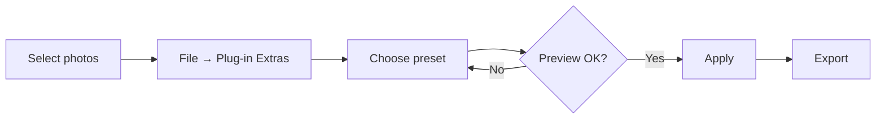

# Usage

## The basic workflow

## Step by step

1. Select one or more photos in the **Library** or **Develop** module.
2. Go to **File → Plug-in Extras → Run**.
3. Pick a preset from the dropdown.
4. Adjust the strength slider.
5. Click **Apply**.

!!! tip "Batch processing"

    Selecting a whole folder works, but processing is sequential. A 500-image
    batch takes roughly :material-clock-outline: 4–6 minutes on an M-series Mac.
    Kick it off and go make coffee.

## Presets

| Preset | What it does | Best for |
| ------ | ------------ | -------- |
| Neutral | Baseline correction only | Mixed batches |
| Warm | Shifts white balance +300K | Golden hour |
| Cool | Shifts white balance −200K | Overcast, snow |
| Film | Adds grain and a tone curve | Portraits |

## Keyboard shortcuts

| Action | Shortcut |
| ------ | -------- |
| Open the plugin | ++cmd+alt+p++ / ++ctrl+alt+p++ |
| Apply last preset | ++cmd+alt+r++ / ++ctrl+alt+r++ |
| Cancel a running batch | ++esc++ |

## Undo

Every change is written as a new develop-history step, so ++cmd+z++ works
normally. To revert an entire batch, select the photos and use
**Develop → Reset**.
